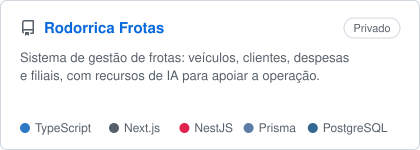
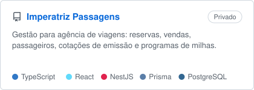
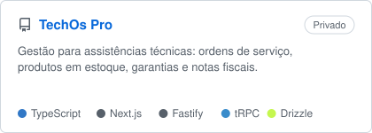
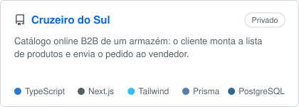

<picture>
  <source media="(prefers-color-scheme: dark)" srcset="https://raw.githubusercontent.com/juliocaesaar/juliocaesaar/output/github-contribution-grid-snake-dark.svg">
  
</picture>

# Olá, eu sou o Júlio 👋

 

Sou desenvolvedor full stack e construo sistemas sob medida para empresas: da modelagem do banco e da API até a interface que o cliente usa no dia a dia. Gosto de entregar produto funcionando, com testes e deploy no ar.

🌐 [juliodevelop.online](https://juliodevelop.online) &nbsp;•&nbsp; 📍 Brasil

---

## 🛠️ Stack

---

## 🚀 Projetos

Boa parte do meu trabalho é privado, feito para clientes. Alguns exemplos:

<table>
<tr>
<td width="50%">

<picture>
  <source media="(prefers-color-scheme: dark)" srcset="assets/cards/rodorrica-frotas-dark.svg">
  
</picture>

</td>
<td width="50%">

<picture>
  <source media="(prefers-color-scheme: dark)" srcset="assets/cards/imperatriz-passagens-dark.svg">
  
</picture>

</td>
</tr>
<tr>
<td width="50%">

<picture>
  <source media="(prefers-color-scheme: dark)" srcset="assets/cards/techos-pro-dark.svg">
  
</picture>

</td>
<td width="50%">

<picture>
  <source media="(prefers-color-scheme: dark)" srcset="assets/cards/cruzeiro-do-sul-dark.svg">
  
</picture>

</td>
</tr>
</table>

---

## 📊 Atividade

---

## 📫 Contato

